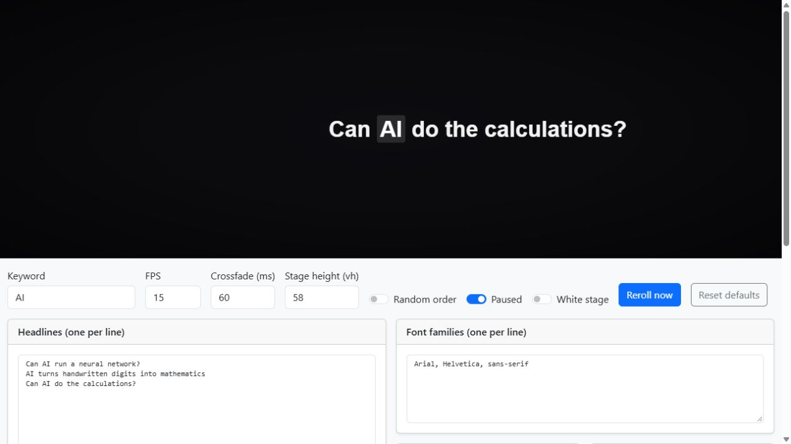

# Headline Animator

A small browser tool for fast headline montages. The words, fonts, and styling change while one shared keyword stays centered, giving the animation a steady focal point.

**[Try the live editor](https://programming-with-julius.github.io/headline-animator/)** · **[Watch the video](https://www.youtube.com/watch?v=qEwmR20Ss9Y)**

*A paused demo frame: “AI” remains at the center while the surrounding headlines can change.*

## Made for the video

This tool was made for **[Neural Network in ChatGPT](https://www.youtube.com/watch?v=qEwmR20Ss9Y)** by Programming with Julius. The opening calls for rapidly switching headlines with **AI** held in focus before introducing ChatGPT.

The video explores whether a language model can carry out the mathematics of another neural network. It starts with a ChatGPT-powered calculator, then trains a PyTorch model on MNIST handwritten digits and extracts its forward pass into mathematical expressions. Each 28 × 28 image supplies 784 pixel values, and ten output expressions correspond to the digits 0–9. The experiment breaks the calculations into smaller pieces for ChatGPT and compares the resulting predictions with PyTorch.

## What you can make

- A rapid sequence of headlines with the first matching keyword centered in every frame.
- Different typography for each frame, using editable font families, weights, styles, sizes, letter spacing, and text transforms.
- Random or sequential headline order, with adjustable FPS and crossfade duration.
- A black or white stage with a configurable height, ready for screen recording.
- A paused frame for checking alignment, with **Reroll now** to preview another combination.

The headline text is editable demo content. Replace it with the wording you want to use in your own video.

## Using it

1. Open the [live editor](https://programming-with-julius.github.io/headline-animator/), or open [`index.html`](index.html) in a browser.
2. Set **Keyword** and enter your **Headlines**, one per line. Include the keyword in each headline you want to align.
3. Edit the typography lists below the stage. Each line is one available option.
4. Adjust **FPS**, **Crossfade (ms)**, and **Stage height (vh)**. Toggle **Random order**, **Paused**, or **White stage** as needed.
5. Screen-record the top stage area for a clean montage. Use **Reset defaults** to start over.

There is no build step or application server. The implementation lives in a single HTML file; the editor styling uses Bootstrap from a CDN.

## How the alignment works

The first keyword match is wrapped in an anchor span. The next headline is laid out in a hidden layer, its keyword position is measured, and the whole line is translated until that keyword sits at the stage center. The two layers then crossfade, avoiding a blank frame between headlines.

Long headlines or large fonts can extend beyond the stage. Use **Paused** to check the framing before recording.

## Companion tool

[`network-animator`](https://github.com/Programming-with-Julius/network-animator) creates glowing neural-network diagrams for the same production workflow.

## Project note and license

> Fully vibe-coded, does not reflect me as a developer.

MIT. See [`LICENSE`](LICENSE).
